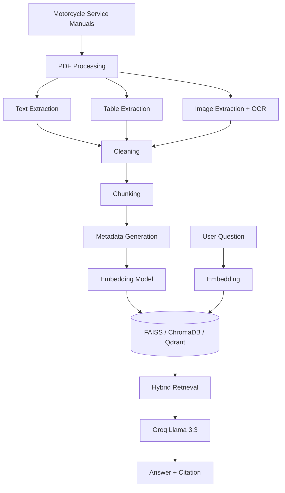

# 🏍️ AI Motorcycle Service Assistant

<p align="center">


</p>

An **AI-powered Multi-Document Retrieval-Augmented Generation (RAG) chatbot** that answers technical questions from motorcycle service manuals using **Large Language Models (LLMs)**, **Hybrid Retrieval**, and **Vector Databases**.

The assistant retrieves the most relevant information from multiple manuals, generates accurate answers with citations, and evaluates retrieval quality using modern RAG evaluation frameworks.

---

# ✨ Features

* 📚 Multi-Document RAG Pipeline
* 🤖 AI-powered Question Answering
* 🔍 Hybrid Retrieval (Semantic + BM25)
* 📖 Source Citation with PDF & Page Number
* 🏷️ Metadata-aware Retrieval
* 📄 Multi-PDF Processing
* 🖼️ Image Extraction & OCR Support
* 📊 RAGAS Evaluation
* 🧪 DeepEval Evaluation
* ⚡ Fast Vector Search
* 🔄 Modular & Scalable Architecture

---

# 📊 Project Statistics

| Item                 | Details                           |
| -------------------- | --------------------------------- |
| 📚 Manuals           | **12 Motorcycle Service Manuals** |
| 📄 Total Pages       | **5,000+ Pages**                  |
| 🖼️ Extracted Images | **2,500+ Images**                 |
| 🧠 Embedding Model   | Sentence Transformers (MiniLM)    |
| 🤖 LLM               | Groq - Llama 3.3 70B              |
| 🔍 Retrieval         | Hybrid Search (FAISS + BM25)      |
| 🗂️ Vector Databases | FAISS, ChromaDB, Qdrant           |

---

# 🏗️ Architecture



---

# 🔄 RAG Workflow

```text
User Question
      │
      ▼
Embedding Generation
      │
      ▼
Semantic Search (FAISS)

          +

Keyword Search (BM25)
      │
      ▼
Hybrid Ranking
      │
      ▼
Top Relevant Chunks
      │
      ▼
Groq Llama 3.3
      │
      ▼
Final Response + Citation
```

---

# ⚙️ Technology Stack

| Category         | Technologies                        |
| ---------------- | ----------------------------------- |
| Programming      | Python                              |
| Framework        | LangChain                           |
| LLM              | Groq (Llama 3.3 70B)                |
| Embeddings       | Sentence Transformers               |
| Vector Databases | FAISS, ChromaDB, Qdrant             |
| PDF Processing   | PyMuPDF, pdfplumber, PyPDF, Camelot |
| OCR              | Tesseract, Pillow                   |
| Retrieval        | Hybrid Search (Semantic + BM25)     |
| Evaluation       | RAGAS, DeepEval                     |

---

# ✂️ Chunking Strategies

Different chunking strategies were explored to improve retrieval quality.

* Recursive Character Chunking
* Token-based Chunking
* Sentence Chunking
* Semantic Chunking
* Parent-Child Chunking
* Document-aware Chunking
* Markdown/Header Chunking

---

# 🏷️ Metadata

Each chunk stores metadata to improve retrieval accuracy and generate source citations.

Example:

```json
{
  "pdf_name": "Service_Manual.pdf",
  "page": 45,
  "chapter": "Engine",
  "section": "Valve Clearance",
  "chunk_id": 142
}
```

---

# 🔍 Hybrid Retrieval

Instead of relying only on semantic similarity, the system combines:

* Semantic Search (FAISS)
* BM25 Keyword Search

This improves:

* Better Recall
* Better Precision
* Better Keyword Matching
* Better Semantic Understanding

---

# 📊 Evaluation

### RAGAS

* Faithfulness
* Answer Relevancy
* Context Precision
* Context Recall

### DeepEval

* Answer Correctness
* Hallucination Detection
* Context Precision
* Context Recall

### Retrieval Metrics

* Top-1 Accuracy
* Top-5 Accuracy
* Recall@K
* Precision@K
* Mean Reciprocal Rank (MRR)
* Mean Average Precision (MAP)

---

# 📁 Project Structure

```text
AI_Motorcycle_Service_Assistant/

├── chatbot/
├── manuals/
├── metadata/
├── vector_store/
├── evaluation/
├── extracted_images/
├── app.py
├── requirements.txt
├── .env.example
└── README.md
```

---

# 🚀 Installation

Clone the repository

```bash
git clone https://github.com/<your-username>/AI_Motorcycle_Service_Assistant.git
```

Install dependencies

```bash
pip install -r requirements.txt
```

Create a `.env` file

```env
GROQ_API_KEY=your_api_key
```

Run the project

```bash
python app.py
```

---

# 💬 Example Questions

* What is the engine oil capacity?
* How do I adjust the clutch cable?
* Explain the valve clearance procedure.
* What is the spark plug gap?
* How often should the air filter be replaced?
* Explain the brake bleeding procedure.

---

# 📜 Copyright Notice

The motorcycle service manuals, extracted images, embeddings, and generated vector databases are **not included** in this repository due to copyright and licensing restrictions.

To use this project:

1. Add your own motorcycle service manuals to the `manuals/` directory.
2. Run the indexing pipeline.
3. Generate embeddings and the vector database.
4. Start the chatbot.

---

# 🚀 Future Improvements

* Agentic RAG
* GraphRAG
* Cross-Encoder Re-ranking
* Voice Assistant
* Multimodal RAG
* REST API
* Docker Deployment
* Kubernetes Deployment

---

# 👨‍💻 Author

**Jenil Mangukiya**

**AI/ML Engineer • Generative AI Developer • Python Developer**

---

## ⭐ Support

If you found this project useful, consider giving it a **⭐ Star** on GitHub.
